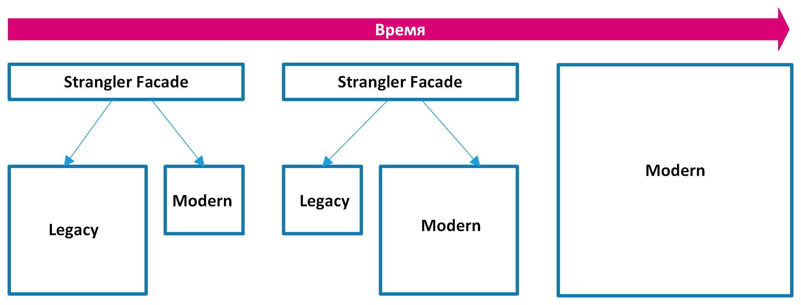

== 2. Выбранный Подход: "Strangler Pattern"

Этот шаблон означает миграцию монолитного приложения на микросервисную архитектуру путем постепенного переноса существующих функций в микросервисы. Настраивается маршрутизация запросов между устаревшим монолитом и микросервисами. Когда очередная функциональность переносится из монолита в микросервисы, фасад перехватывает клиентский запрос и направляет его к микросервисам. Новые функции при этом реализуются исключительно в микросервисах, минуя монолит. После переноса всех функций монолитное приложение полностью выводится из эксплуатации.

=== Основные принципы

* Оболочка или фасад (Wrap): Создаем API для существующей функциональности монолита. Это позволяет микросервисам общаться с монолитом через стабильные интерфейсы.
* Трансформация (Transform): Постепенно переносим функциональность из монолита в новые микросервисы.
* Перенаправление (Re-route): Перенаправляем трафик от монолита к новым микросервисам.

=== Преимущества

* Минимизация рисков: Постепенный переход снижает риск сбоев и простоя системы.
* Гибкость: Позволяет гибко менять планы, если возникают непредвиденные трудности.
* Параллельная разработка: Разработчики могут работать над новыми сервисами, не затрагивая всю систему.
* Постепенное обучение: Команда постепенно приобретает опыт работы с микросервисной архитектурой.

// относительный путь к изображению не работает -- почему??

