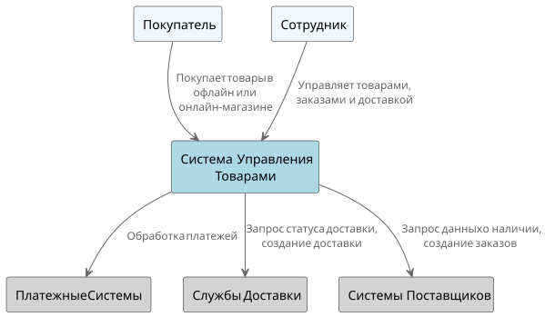
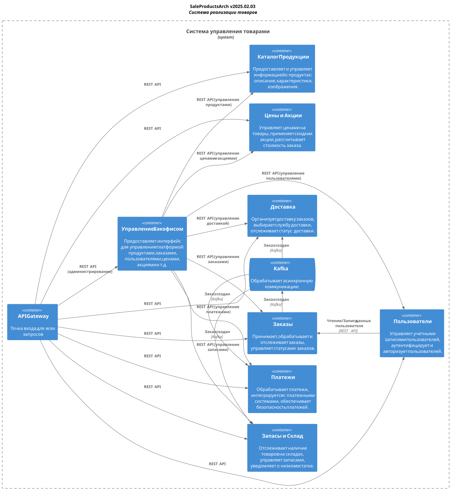

== 3. Доменные Области Бизнеса

В соответствии с подходом DDD (Domain-Driven Design), выделены следующие доменные области и субдомены:

* Каталог Продукции:
** Управление информацией о товарах (наименование, описание, характеристики).
** Категории и подкатегории товаров.

* Запасы и Склад:
** Учет остатков на собственных складах и складах поставщиков.
** Управление перемещениями между складами.

* Цены и Акции:
** Управление ценами и скидками.
** Управление акциями и промокодами.
** Расчет стоимости товаров с учетом скидок.

* Заказы:
** Оформление и обработка заказов в офлайн и онлайн-магазине.
** Управление статусами заказов.
** Управление корзиной покупок.
** История заказов покупателей.

* Пользователи:
** Управление учетными записями покупателей.
** Авторизация и аутентификация.

* Доставка:
** Планирование и управление доставкой заказов.
** Интеграция с партнерскими службами доставки.
** Отслеживание статуса доставки.

* Платежи:
** Обработка онлайн-платежей.
** Интеграция с платежными шлюзами.
** Формирование счетов.

* Управление бэкофисом:
** Кадровая служба и календарное планирование.
** Бухгалтерия и управление ресурсами.

Верхнеуровневое разбиение. С4.level1.

Верхнеуровневое разбиение. С4.level2.

// относительный путь к изображению не работает -- почему??