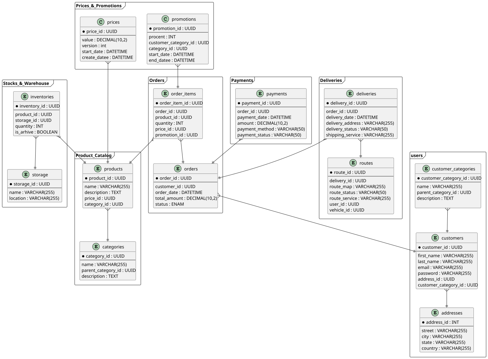

== Мдель сущностей и связей

Для верного тактования схемы, предлагается условиться на том, что каждый фрейм на схеме является необходимым уровнем абстракции, отображающим отдельные друг от друга системы со своими базами (приемущественно реляционными). 

Связи между сущнастями из разных фреймов обозначают тракты передачи данных между системами (REST / Queue). 

На данной схеме не отражены некоторые сервисы, упомянутей ранее, а именно 'Управление бэкофисом', 'Нотификация', 'Авторизация'.