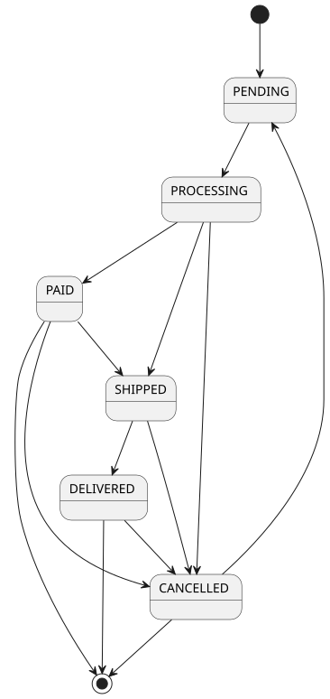

== Статусная модель для сущностей

В  данном документе описаны статусные модели для заказов и платежей. 

[width="100%",options="header", cols="<,^,<"]
|====================
|status_name | Наименование статуса | Описание
|PENDING
|в ожидании
|Заказ находится в стадии формирования на стороне  Клиента
|PROCESSING
|в обработке
|Закакз проходит проверку  на возможность дальнейшего формирования на стороне Склада
|SHIPPED
|отправлен
|Заказ отгружен со Склада. Находится в пути.
|DELIVERED
|доставлен
|Заказ доставлен Клиенту. Клиент подтвердил получение Заказа
|CANCELLED
|отменен
|Закакз отменен на стороне Клиента / Склада / Доставки
|PAID
|оплачен
|Закакз оплачен
|====================
